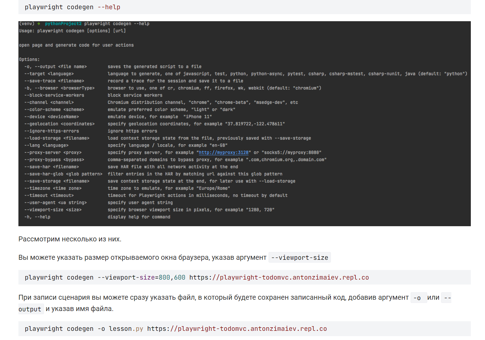
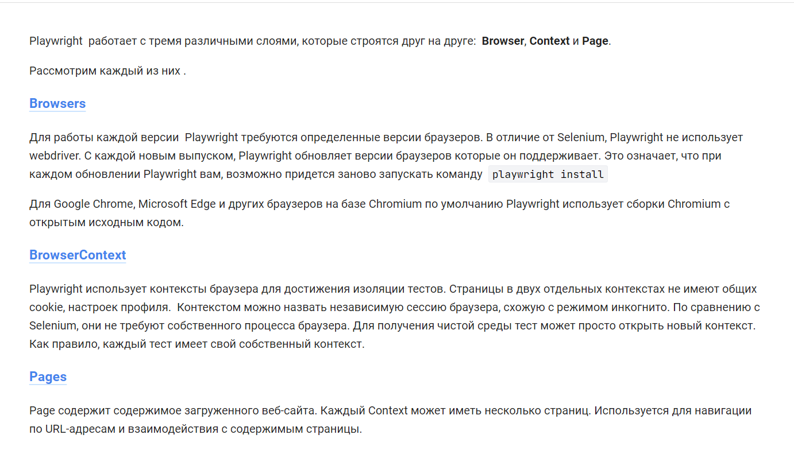
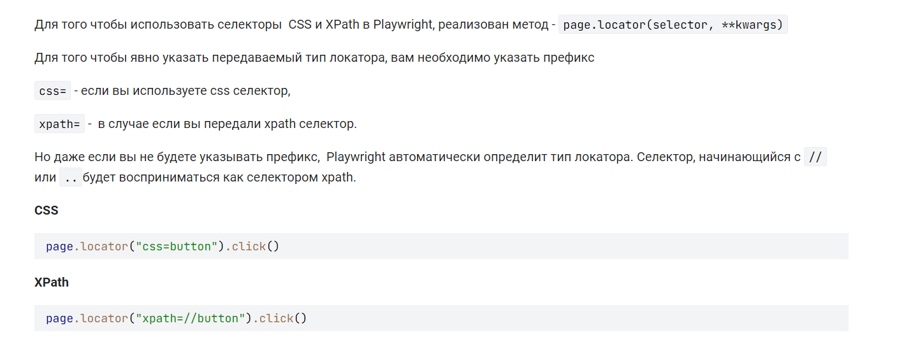

pip install -r requirements.txt 

playwright install

Запуск codegen:
playwright codegen https://playwright-todomvc.antonzimaiev.repl.co/#/ - autogenerate autotest

playwright documentation - https://playwright.dev/python/docs/pages

codegen commands:

Парадигма playwright:

https://playwright.dev/python/docs/browsers

https://playwright.dev/python/docs/api/class-browsercontext

https://playwright.dev/python/docs/pages

